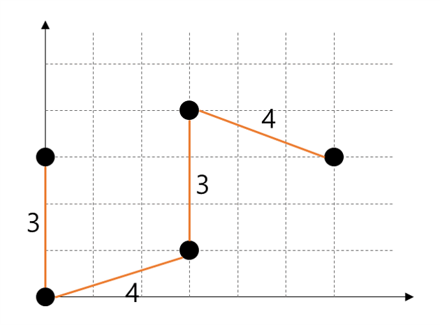

# Problem3

## 문제 설명

당신에게 2차원 평면상의 좌표 `x[i]`와 `y[i]`가 주어진다.

각 좌표에 찍혀있는 점을 서로 연결하는 데에는 두 좌표 사이의 '맨하탄 거리' 만큼의 비용이 든다.

`i`번째 점과 `j`번째 점 사이의 맨하탄 거리는 아래와 같이 정의된다.

`manhattan(i, j) = |x[i] - x[j]| + |y[i] - y[j]|`

이 때, 모든 점을 연결하는 데에 필요한 최소의 비용을 구하시오.

## 매개변수 형식

`x = [0, 0, 3, 3, 6]`

`y = [0, 3, 1, 4, 3]`

## 반환값 형식

`14`

## 입출력 설명

아래와 같이 연결했을 때 최소의 비용이 된다.

