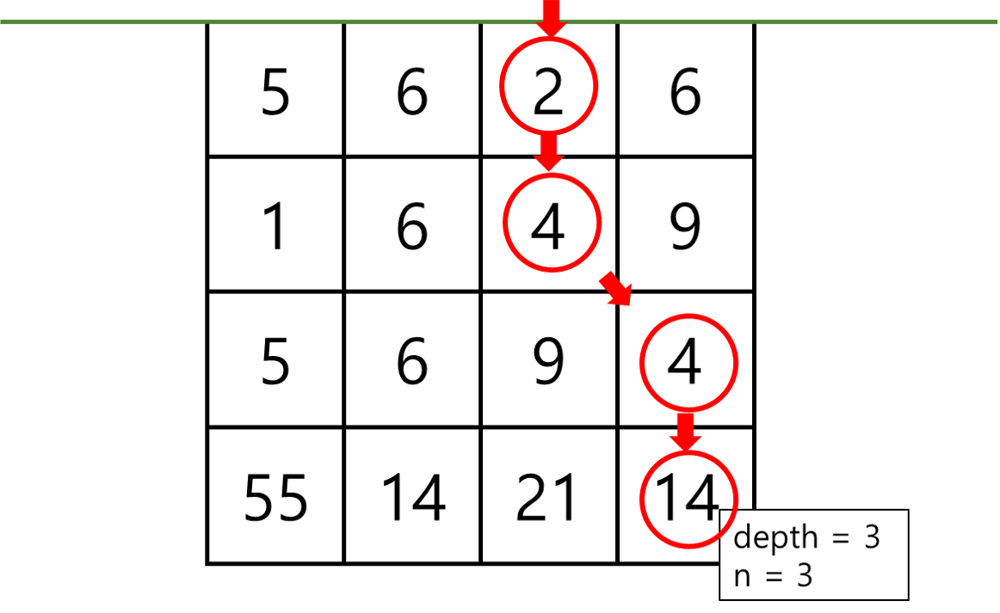

# Problem2

## 문제 설명

누리는 개발 공부를 하다 보니 삽으로 땅을 파는 데에 전문가가 되었다. 누리가 파내는 땅은 블록 형태로 구분되어있고, 각 블록은 제거하는 데에 서로 다른 에너지가 소비된다. 땅에 있는 첫 번째 블록은 깊이가 `0`부터 시작하며, 한칸씩 내려갈 때 마다 깊이가 `1`씩 증가한다. 누리가 블록을 제거할 수 있는 조건은 아래와 같다.

* 깊이 `0`에 위치한 블록은 자유롭게 제거할 수 있다.
* 깊이 `d`에 위치한 `i`번째 블록을 제거하려면, 깊이 `d-1`에 위치한 `i-1`, `i`, `i+1`번째 블록 중 하나가 제거되어 있어야 한다.

누리는 깊이 `depth`의 `n`번째 블록에 위치한 화석을 발굴하려고 한다. 각 깊이별 블록을 제거하는 데에 필요한 에너지는 `blocks`에 저장되어 있다. 화석이 위치한 블록을 제거하는 데에 필요한 최소의 에너지를 구하시오. (단, `n`은 `0`부터 시작하며, 모든 깊이에는 동일한 숫자의 블록이 있다.)

## 매개변수 형식

`depth = 3`

`n = 3`

`blocks = [[5, 6, 2, 6], [1, 6, 4, 9], [5, 6, 9, 4], [55, 14, 21, 14]]`

## 반환값 형식

`24`

## 예시입출력 설명

아래와 같이 블록을 제거할 경우 최소의 에너지로 화석을 얻을 수 있다.

