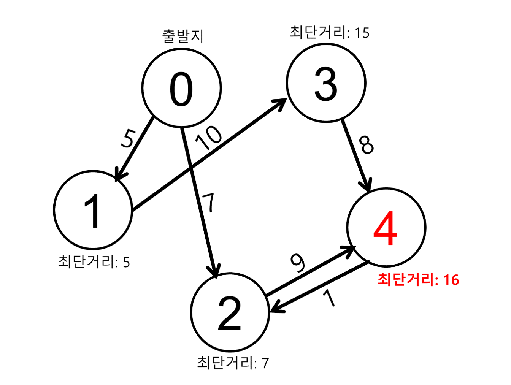

# Problem2

## 문제

당신은 네비게이션 시스템을 개발하기 위해 최단 거리를 계산하는 프로그램을 만들고 테스트하려 한다.

최단 거리를 계산하고자 하는 공간에는 총 `N`개의 장소가 존재한다.

`a`번째 장소에서 `b`번째 장소로 이동하는 데에 걸리는 시간 `time`이 `edge[i] = [a, b, time]`로 주어진다고 하자.

당신은 `0`번째 장소에 있다고 할 때, 최단 거리로 도달하는 데에 가장 오래 걸리는 장소의 인덱스를 출력하시오.

단, 정답이 여럿일 경우 더 작은 인덱스를 반환하시오.

## 매개변수 형식

`N = 5`

`edge = [[0, 1, 5], [0, 2, 7], [1, 3, 10], [3, 4, 8], [2, 4, 9], [4, 2, 1]]`

## 반환값 형식

`4`

## 입출력 예시 설명

각 장소는 아래와 같이 구성되며, 최단 거리가 가장 먼 장소는 `4`임을 알 수 있다.

